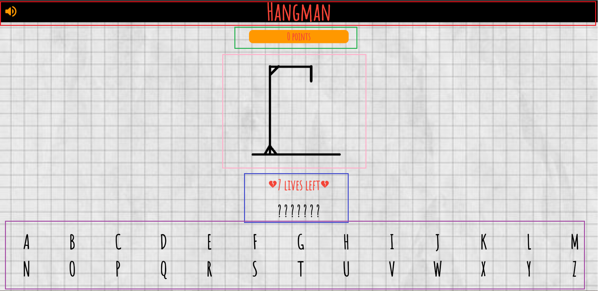

# hangman-app

### Red Frame - Top bar with the game title and a speaker icon, allowing the user to mute the application sounds.
### Green Frame - Score counter, changing based on the user's correct and incorrect answers.
### Pink Frame - Visualization using images of the current game state.
### Blue Frame - Number of lives remaining for the player and below it, the password to be guessed.
### Purple Frame - Available letters from which the user should guess the password.
